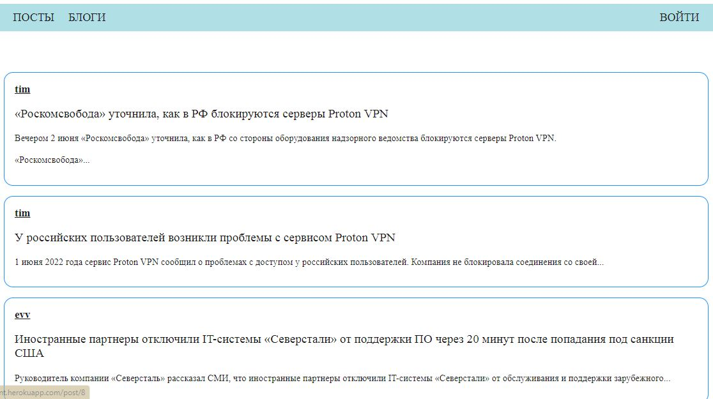

# Simple Blog

## HOWTO

- run server\
  `git clone https://github.com/AnnaRozhnova/blog.git  
   cd blog\
   go run cmd/main.go`\
- run client\
  `git clone https://github.com/AnnaRozhnova/blog-client.git\
   cd blog-client\
   npm instal\
   npm start --port 3000`
    

